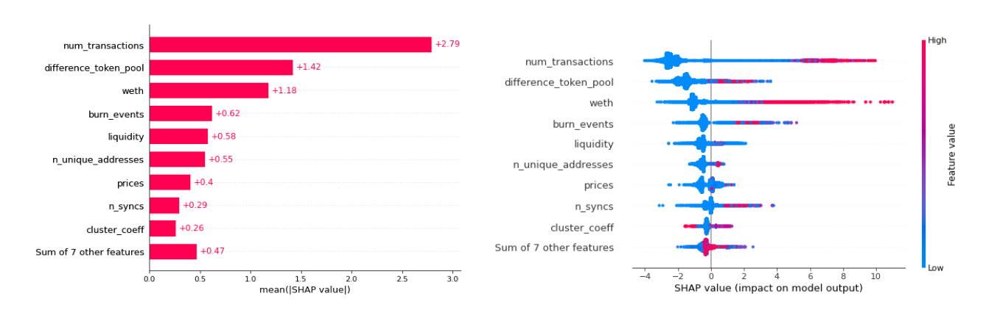
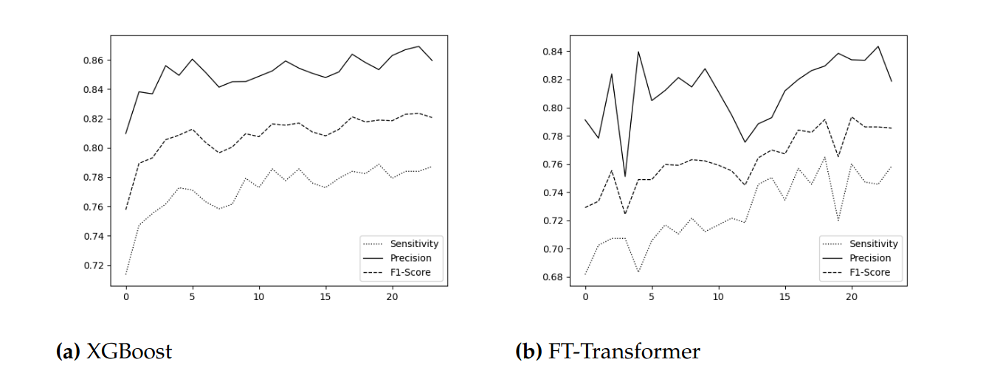

# SCRF: Template - Research Summary

---
title: DO NOT RUG ON ME: ZERO-DIMENSIONAL SCAM DETECTION
description: One or two sentences of what the post is about.
tags: DeFi, Machine learning, Scam Detection,Rug pulls
created: 2020-12-25
researcher: Bruno Mazorra and Victor Adan
---

> ### TLDR
>
> - The reaserchers expand the dataset of Uniswap v2 scam tokens.
> - They provide  a theoretical classification of three different types of rug pulls and provide tools to identify them.
> - The authors introduce two highly accurate and precise Machine learning-based models to discriminate between malicious and nonmalicious tokens in different scenarios before the malicious manuever.

### Core Research Question

Do rug pulls in Constant Function Marker Makers (CFMM) share similar features? Can we predict if a project is a rug pull before the malicius manuver? 

Uniswap, like other DEXs, has gained much attention this last year because it is a non-custodial and
publicly verifiable exchange that allows users to trade digital assets without trusted third parties.
However, its simplicity and lack of regulation also makes it easy to execute initial coin offering scams
by listing non-valuable tokens. This method of performing scams is known as rug pull, a phenomenon
that already existed in traditional finance but has become more relevant in DeFi. 

In this work, we introduce a methodology to detect rug pulls before the malicious manuever execution.
### Citation

- Mazorra, Bruno, Victor Adan, and Vanesa Daza. "Do not rug on me: Zero-dimensional Scam Detection." arXiv preprint arXiv:2201.07220 (2022).

### Background

- Smart contract: Programs which are deployed on the blockchain public ledger and are executed in transactions and alter the state of the ledger atomically.
- Decentralized Exchange: Decentralized Exchanges (DEXs) are a category of Decentralized Finance (DeFi)
protocol that allow the non-custodial exchange of digital assets. All trades are executed 
on-chain and are, thus, publicly verifiable. The policy that matches buyers and sellers (or
traders and liquidity providers) is hard-coded in a smart contract
- Rug pull: Is a malicious operation or set of operations in the cryptocurrency industry where the developers abandon the 
project and take the investors’ funds as profits
- Transaction graph: Weighted graph induced by token transactions. 
- Herfindahl-Hirschman Index: A measure of market concentration and is used to calculate market competitiveness
- Cluster coefficient: Is a measure of network segregation that captures the
connections of individual nodes and their neighbors.
- Precision: Is defined by     
- Recall: Is defined by     
- ML classifier:
- Cross validation:
- Data agumentation:

### Summary

1. Introduction.
2. Related Work.
3. Preliminars
    - Background.
4. Malicious Uniswap Maneuvers
    - Classification of different type of rug pulls.
5. Data Collection:
    - Overview of the method used to extract all the necessary data.
6. Token Labelling.
    - Provide the methodology to label tokens as scams or non-scams.
    - Overview of the results obtained by the labelling methodology proposed.

### Method
- **Data collection**: To obtain all the data needed to do the labelling and the analysis, we used an [Infura archive](https://infura.io/) node and the Etherscan
API. To obtain the state of the Uniswap exchange and the tokens, we used the events produced by their respective
smart contracts. To obtain the token transactions creation and the source code, we used [Etherscan API](https://etherscan.io/apis).
- **Labelling**:
    -  First, we defined the maximum drop and the recovery of token prices and liquidity time series. The maximum drop measures fall in the price or liquidity of the Uniswap listed pools. The recovery represents the largest pump from the bottom. Also, if more than one month has passed between the last movement or transaction of the token so far, we consider that the token is inactive. This made a total of 27,588 tokens that could be tagged as malicious since they were inactive tokens, that had, at some point, lost all their value in price or liquidity and had not recovered it again.
  
    - Non-malicious tokens cannot be chosen from a liquidity, price, and activity analysis. Given a token, it may be considered malicious if there has been at least one rug pull at some point in its activity. However, a token that has not had any rug pull cannot be considered non-malicious, since it could experience a rug pull later on. Therefore, we take advantage of audits carried out by external companies (Certik, Quantstamp, Hacken...). Thus, a list of 674 tokens labelled as non-malicious have been mined from different sources: [coinmarketcap](https://coinmarketcap.com/view/defi/), [coingecko](https://www.coingecko.com/en/categories/decentralized-finance-defi), [etherscan](https://etherscan.io/tokens).

- **Machine Learning**: We defined two methods that use Machine Learning models to discriminate between malicious and non-malicious tokens: Activity based Method and 24 Early Method.  
    - Activity based Method: For each token labelled as malicious, we have randomly selected several evaluation points before the maximum drop. Non-malicious tokens have been evaluated throughout their activity. Then, for each evaluation point, we calculated the token features up to that block and used them to train two ML classifiers (XGBoost and FT-Transformer) to find patterns related to malicious activity. 
    
    

    
    

    - 24 Early Method: For each labelled token, we have computed its features in each of the 24 hours after its pool creation. In this case, we are training the models for each hour, therefore, we only have one evaluation point for each token. This also implies that the dataset is smaller compared to the other method.

<!-- Specifically, we use a new Machine Learning algorithm based on attention mechanisms for tabular data called FT-Transformer. -->
<!-- 
Describe the general approach of the paper (e.g scientific experiment, data/modeling, mathematical proofs) then outline the key steps that the researchers undertook to perform the study.

For each key step, summarize the nature of the specific approach that the researchers used to complete each step (e.g. statistical test, logic proof, data-driven model). -->

### Results

Most tokens are labelled as malicious. Indeed, it would be enough to label all of them as malicious to achieve an accuracy of 97,7%. Therefore, we used a data augmentation technique that consists of choosing more evaluation points for non-malicious tokens than for malicious tokens. In particular, we selected five evaluation points for non-malicious tokens and one for the malicious. In addition, we labelled the non-malicious tokens as 1 and the malicious tokens as 0 and tried to increase the performance in predicting non-malicious tokens. To validate both methods we used 5-fold cross-validation, therefore all the results will be presented as the mean and standard deviation of all folds.

#### Activity based Method Results

- Both XGBoost and FT-Transformer get high metrics for accuracy, recall, precision, and F1-Score. However, XGBoost outperforms FT-Transformer in all metrics. 
- XGBoost obtains an accuracy of 0.9936, recall of 0.9540 and precision of 0.9838 in distinguishing non-malicious tokens from scams. In contrast, FT-Transformer gets an accuracy of 0.9890, recall of 0.9180 and precision of 0.9752. 
Therefore, from now we will only analyse on XBoost results. 

<!-- 

    
The figure above shows the feature importance in terms of SHAP value on the left side, and, on the right, the impact on the final output.
Most malicious tokens die in the first 24 hours after the pool is created; by contrast, non-malicious tokens have longer lives. This explains why features such as number of transactions or number of unique addresses have so much weight in the model. 
Also, noticed that less block difference between token and pool creation implies negative SHAP values, and negative SHAP values should correspond to malicious tokens. This conclusion coincides with (cite) since several of the malicious tokens take advantage of social trends by copying the name of official tokens and taking money from investors who get confused. This technique implies speed in the creation of the token and the pool since otherwise, the trend may be lost. -->

#### 24 Early Method Results

- For each labelled token, we have computed its features in each of the 24 hours after its pool creation. In this case, we are training both models for each hour. Therefore, we only have one evaluation point for each token.

    
- Our algorithm obtains a very high accuracy even in the first hours. However, the precision, recall and f1-score are lower than in Activity based Method. In the best of cases, i.e. 20 hours after the creation of the pool, our best algorithm obtains a recall of 0.789. This could indicate that while malicious tokens are easily detectable in the first few hours, detecting non-malicious tokens require more time.

### Discussion and Key Takeaways

- We provided a theoretical classification to understand the different ways of executing the scam, and through the process of identifying rug pulls we found new token smart contract vulnerabilities (composability attacks) and new ways of money laundering.
- We provided a methodology to find rug pulls that had already been executed. Not surprisingly, we found that more than the 97,7\% of the tokens labelled were rug pulls.
- We defined two methods that use ML models to distinguish non-malicious tokens from malicious ones. We also verify the high effectiveness of these models in both scenarios.

<!-- Summarize any discussion/commentary sections included by the researchers. Identify the most concise description of any perspectives or viewpoints the researchers explored in this section.

Summarize the conclusions or key takeaways as included by the researchers. -->

### Implications and Follow-ups

<!-- Summarize the implicit or explicit implications of the study. If the researchers include such a section, include a few of the most important points discussed. If not, insert some commentary of clear-cut or obvious implications of the work.

Share any follow-up work discussed by the researchers.
 -->
 
 
### Applicability

- To better understand the methodology used by scammers to execute rug pulls.
- Provide machine learning tools to protect users from permanet losses. 
